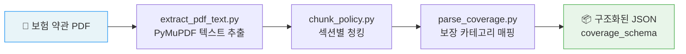

# ✈️ Polight

**Portable · Light · Flight**

> 2026-1 졸업 작품 (AZAMS팀) · **FIN:NECT 챌린지 예선 통과** 🏆

Polight는 여행자 보험 약관 PDF를 자동으로 분석하여, 복잡한 보장 항목을 한눈에 파악할 수 있도록 도와주는 **여행자 보험 AI 챗봇 앱 서비스**입니다.

---

## 💡 서비스 배경

| Pain Point | 설명 |
|---|---|
| 복잡한 약관 | 전문 용어가 많아 일반 사용자가 이해하기 어려움 |
| 보장 범위 불투명 | 어떤 항목을 얼마나 보장하는지 한눈에 파악 불가 |
| 해외 사고 시 혼란 | 필요 서류·연락처를 몰라 당황하는 경우가 많음 |

**"보험에 가입은 하지만 약관은 읽지 않는"** 여행자를 위해,  
PDF를 업로드하면 AI가 자동으로 분석하고 쉬운 말로 설명해주는 서비스입니다.

---

## 🗂️ 전체 서비스 화면 구성

```
홈 대시보드       PDF 업로드          보장 상세 내역         AI 챗봇
─────────────   ─────────────────   ────────────────────   ──────────────────────
현재 여행 현황   PDF 업로드          의료비 / 항공지연 /    해외 사고 대응 가이드
빠른 메뉴        → AI 자동 파싱      수하물 / 긴급이송 /    24시간 실시간 응답
보험 현황 요약   보장 항목 분석      치과 응급 / 배상책임   위치기반 병원 안내
                 용어 쉽게 설명      미보장 항목 구분       청구 절차 단계 안내
```

---

## ⚙️ AI 파이프라인



### 단계별 설명

| 단계 | 스크립트 | 역할 |
|------|----------|------|
| 1. 텍스트 추출 | `extract_pdf_text.py` | PyMuPDF로 페이지별 텍스트 추출 및 정규화 |
| 2. 섹션 청킹 | `chunk_policy.py` | 목차 패턴으로 섹션 탐지 후 청크 분리 |
| 3. 카테고리 매핑 | `parse_coverage.py` | 키워드 기반으로 표준 보장 항목 분류 |
| 4. 파이프라인 실행 | `run_pipeline.py` | 위 3단계를 순서대로 일괄 처리 |

---

## 📋 지원 보장 항목 (standard_categories)

| 카테고리 ID | 표시명 | 설명 |
|---|---|---|
| `medical_expense` | 의료비 | 여행 중 질병·상해 의료비 |
| `flight_delay` | 항공 지연 | 항공편 지연·취소·결항 |
| `baggage` | 수하물/휴대품 | 분실·파손·지연 보상 |
| `emergency_transport` | 긴급 이송 | 사망·부상·질병 긴급 이동 |
| `dental_emergency` | 치과 응급 | 여행 중 치과 응급 처치 |
| `liability` | 배상 책임 | 타인 신체·재물 피해 배상 |
| `trip_cancellation` | 여행 취소/중단 | 불가피한 여행 취소·중단 보상 |
| `death_disability` | 사망/후유장해 | 사망 또는 영구 장해 보상 |

---

## 🛠️ 기술 스택

| 분류 | 기술 |
|---|---|
| 언어 | Python 3.11+ |
| PDF 파싱 | PyMuPDF (`fitz`) |
| 데이터 검증 | Pydantic |
| 환경 설정 | python-dotenv |
| 진행 표시 | tqdm |

---

## 📁 프로젝트 구조

```
capstone-polight-ai/
├── scripts/
│   ├── extract_pdf_text.py   # PDF → 페이지별 텍스트 JSON
│   ├── chunk_policy.py       # 텍스트 → 섹션 청크 JSON
│   ├── parse_coverage.py     # 청크 → 보장 카테고리 매핑 및 요약 출력
│   └── run_pipeline.py       # 전체 파이프라인 일괄 실행
├── config/
│   ├── coverage_schema.json      # 출력 JSON 스키마 정의
│   ├── standard_categories.json  # 표준 보장 카테고리 목록
│   └── category_mapping.json     # 카테고리별 키워드 매핑
├── data/
│   ├── raw_pdfs/             # 원본 보험 약관 PDF (gitignore)
│   ├── extracted_text/       # 추출된 페이지 텍스트 JSON
│   └── chunks/               # 섹션 청크 JSON
├── .env.example              # 환경 변수 예시
├── .gitignore
└── requirements.txt
```

---

## 🚀 실행 방법

### 1. 의존성 설치

```bash
pip install -r requirements.txt
```

### 2. 환경 변수 설정

```bash
cp .env.example .env
# .env 파일에 필요한 값 입력
```

### 3. PDF 파이프라인 실행

```bash
# 특정 PDF 처리
python scripts/run_pipeline.py --pdf kakao_travel_2025.pdf

# data/raw_pdfs/ 내 모든 PDF 처리
python scripts/run_pipeline.py
```

### 4. 결과 확인

```bash
# 청킹·카테고리 매핑 결과 요약 출력
python scripts/parse_coverage.py data/chunks/kakao_travel_2025_chunks.json --top-n 10
```

---

## 📅 개발 로드맵

| 기간 | 단계 | 주요 작업 |
|---|---|---|
| 4월 | 기획·설계 완료 | PDF 전처리 구조 설계, 카테고리 체계 확립 |
| 5~6월 | **핵심 기능 개발** | 약관 구조 분석, PDF 전처리, 조항 태깅, 임베딩 생성, LLM 연결 |
| 6~8월 | AI 챗봇 개발 | 임베딩 + 벡터 DB 구축, LLM 연결, 프롬프트 설계, 응답 정확도 개선 |
| 8월 | 최적화 | 응답 정확도 개선 |
| 9월 | QA · 전시 준비 | QA, 모델 보완, 전시 준비 |

---

## 👥 팀 AZAMS

| 역할 | 이름 |
|---|---|
| PM & 프론트엔드 | 김류지 |
| 백엔드 | 손채민 |
| AI | 정지윤 |

---

## 🔗 관련 링크

- 전체 서비스 레포지토리: [Polight](https://github.com/Crazy-Capstone)
