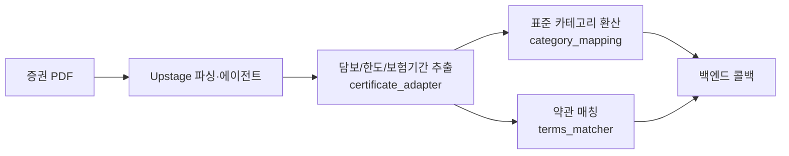
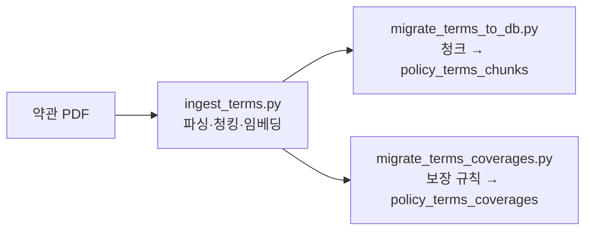
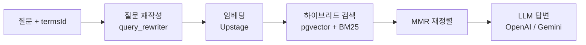

# ✈️ Polight — AI

**Portable · Light · Flight**

> 2026-1 졸업 작품 (AZAMS팀) · **FIN:NECT 챌린지 우수상 수상** 🏆

Polight는 여행자 보험 증권과 약관을 자동 분석해, 복잡한 보장 내용을 한눈에 보여주고
사용자의 질문에 약관 근거로 답하는 **여행자 보험 AI 서비스**입니다.
이 저장소는 그중 **AI 서버**(증권 분석 · 약관 RAG 챗봇 · 보장 상세)를 담당합니다.

---

## 💡 서비스 배경

| Pain Point | 설명 |
|---|---|
| 복잡한 약관 | 전문 용어가 많아 일반 사용자가 이해하기 어려움 |
| 보장 범위 불투명 | 어떤 항목을 얼마나 보장하는지 한눈에 파악 불가 |
| 해외 사고 시 혼란 | 필요 서류·연락처를 몰라 당황하는 경우가 많음 |

**"보험에 가입은 하지만 약관은 읽지 않는"** 여행자를 위해,
증권을 올리면 담보를 자동 분석하고, 약관 근거로 질문에 답해주는 서비스입니다.

---

## 🧩 AI 서버 역할

세 가지 기능이 있고, DB 사용 여부가 서로 다릅니다.

| 기능 | 설명 | 저장소 |
|---|---|---|
| **증권 분석** | 사용자가 올린 증권 PDF에서 담보·한도·보험기간을 추출해 백엔드로 콜백 | DB 미사용(결과 백엔드 저장) |
| **보장 상세** | 약관에서 보장 규칙(면책·세부한도·청구서류)을 추출해 DB 적재, 증권 담보와 연결 | pgvector |
| **AI 챗봇** | 약관을 검색해 사용자의 질문에 근거 기반으로 답변(RAG) | pgvector |

증권 담보와 약관 규칙은 **표준 카테고리**(8종)로 이어집니다.

---

## ⚙️ AI 파이프라인

### 1. 증권 분석 (사용자 업로드)


```mermaid
flowchart LR
    A[증권 PDF] --> B[Upstage 파싱·에이전트]
    B --> C[담보/한도/보험기간 추출<br/>certificate_adapter]
    C --> D[표준 카테고리 환산<br/>category_mapping]
    C --> E[약관 매칭<br/>terms_matcher]
    D --> F[백엔드 콜백]
    E --> F
```

### 2. 약관 색인·적재


```mermaid
flowchart LR
    A[약관 PDF] --> B[ingest_terms.py<br/>파싱·청킹·임베딩]
    B --> C[migrate_terms_to_db.py<br/>청크 → policy_terms_chunks]
    B --> D[migrate_terms_coverages.py<br/>보장 규칙 → policy_terms_coverages]
```

### 3. AI 챗봇 (RAG 기반 실시간 응답)


```mermaid
flowchart LR
    A[질문 + termsId] --> B[질문 재작성<br/>query_rewriter]
    B --> C[임베딩<br/>Upstage]
    C --> D[하이브리드 검색<br/>pgvector + BM25]
    D --> E[MMR 재정렬]
    E --> F[LLM 답변<br/>OpenAI / Gemini]
```

---

## 📋 표준 보장 카테고리 (standard_categories)

증권 담보와 약관 규칙을 잇는 공통 키입니다.

| 카테고리 ID | 표시명 |
|---|---|
| `medical_expense` | 의료비 |
| `flight_delay` | 항공 지연 |
| `baggage` | 수하물/휴대품 |
| `emergency_transport` | 긴급 이송 |
| `dental_emergency` | 치과 응급 |
| `liability` | 배상 책임 |
| `trip_cancellation` | 여행 취소/중단 |
| `death_disability` | 사망/후유장해 |

---

## 🛠️ 기술 스택

| 분류 | 기술 |
|---|---|
| 서버 | FastAPI · Uvicorn |
| 언어 | Python 3.14 |
| PDF 파싱 | Upstage Document Parse · PyMuPDF |
| 임베딩 | Upstage Embedding (`upstage-1536`) |
| 벡터 검색 | PostgreSQL + pgvector (하이브리드: 벡터 + BM25) |
| LLM | OpenAI (GPT-4.1) · Google Gemini |
| 데이터 검증 | Pydantic |
| 배포 | Docker · Docker Compose |

> LLM·임베딩 벤더는 `.env`(`ANSWER_PROVIDER`, `EMBEDDING_PROVIDER` 등)로
> 코드 변경 없이 교체됩니다.

---

## 📁 프로젝트 구조

```
polight-ai/
├── app/
│   ├── main.py                    # FastAPI 진입점
│   ├── api/routes/
│   │   ├── analysis.py            # POST /internal/analysis  (증권 분석 접수)
│   │   ├── rag.py                 # POST /internal/rag/query (챗봇)
│   │   └── health.py
│   ├── services/
│   │   ├── analysis_service.py    # 증권 분석 오케스트레이션
│   │   ├── certificate_adapter.py # 증권 → 담보 payload(+category 환산)
│   │   ├── upstage_parser.py      # Upstage 문서 파싱
│   │   ├── terms_matcher.py       # 증권 ↔ 약관 매칭
│   │   ├── rag_service.py         # 챗봇 RAG 파이프라인
│   │   ├── query_rewriter.py      # 검색용 질문 재작성
│   │   ├── prompt_builder.py      # 답변 프롬프트
│   │   ├── coverage_extractor.py  # 약관 보장 규칙 추출(LLM)
│   │   ├── answer_providers.py    # LLM 벤더 레지스트리
│   │   └── embedding_*.py, bm25.py, reranker.py
│   ├── repositories/
│   │   ├── pg_repository.py       # pgvector 검색(policy_terms_chunks)
│   │   ├── terms_repository.py    # 약관/규칙 적재
│   │   └── file_repository.py     # 파일 기반 저장소(로컬/평가용)
│   └── schemas/                   # 요청·응답·DB 스키마
├── scripts/
│   ├── ingest_terms.py            # 약관 파싱·청킹·임베딩(파일 저장소)
│   ├── migrate_terms_to_db.py     # 약관 청크 → DB 이관
│   ├── migrate_terms_coverages.py # 약관 보장 규칙 → DB 적재
│   └── ... (전처리·평가·비교 도구)
├── config/
│   ├── standard_categories.json   # 표준 보장 카테고리(8종)
│   ├── category_mapping.json      # 담보명 → 표준 카테고리 매핑
│   └── terms_registry.json        # 보유 약관 목록(보험사·상품·개정)
├── docker/initdb/01_schema.sql    # DB 스키마(로컬 검증용 사본)
├── docker-compose.prod.yml
├── Dockerfile
└── requirements.txt
```

---

## 🚀 실행 방법

### 로컬 개발

```bash
pip install -r requirements.txt
cp .env.example .env          # API 키 등 입력
uvicorn app.main:app --reload
```

`DATABASE_URL`이 비어 있으면 파일 저장소로, 설정되면 pgvector로 동작합니다.

---

## 👥 팀 AZAMS

| 역할 | 이름 |
|---|---|
| PM & 프론트엔드 | 김류지 |
| 백엔드 | 손채민 |
| AI | 정지윤 |

---

## 🔗 관련 링크

- 전체 서비스 조직: [Crazy-Capstone](https://github.com/Crazy-Capstone)
